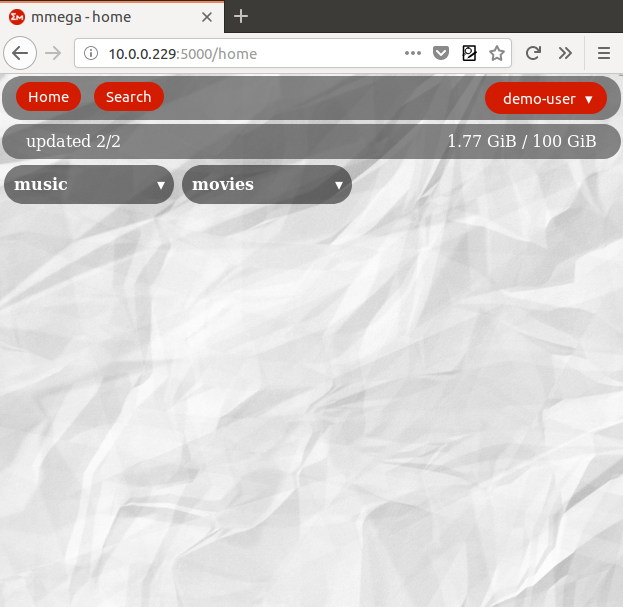

# MEGA multi-account web application
Flask application to check multiple registered mega accounts, using [megatools](https://github.com/megous/megatools) and [MEGAcmd](https://mega.nz/cmd).

At the moment megatools is used to obtain the information of the remote files, since it is easier to process the output of megals --export (with the link and the path) than mega-ls and mega-export. However, the synchronization operation is much easier with MEGAcmd, just one command (see below about sync proccess). In addition, future features such as moving files between different accounts, can only be done with MEGAcmd.

>If you are going to create a new account in mega.nz, do it through megareg (megatools suite), since there has been a change in the authentication protocol and the registration through the web does not work with megatools. See this [issue](https://github.com/megous/megatools/issues/411).

This application is designed to be used in home networks and **should not be exposed to internet**. If you want to use this application outside of your home network you should create a VPN or another type of private connection. In addition **you must be the administrator of the computer that runs this application**, since it contains the login parameters of each mega account in plaintext and creates temporary files with those parameters.

The application has a responsive design, so it can be displayed correctly on mobile devices.

### Dependencies
* Ubuntu 16.04
* megatools 1.9.97
* MEGAcmd 0.9.9
* python-pip 18.1 (python 2.7)
* virtualenv 16.0.0  (if a virtual environment is used)
* python dependecies (see requeriments.txt)

### Install
If you want to install this app in a virtual environment use option 3.

Option 1 - You can download or copy the script (bash) `full_install_mmega.sh`. It will install all the system packages, download this repository, install the python packages and delete i. You will be asked for your sudo password.

Option 2 - Clone this repository: `git clone git@bitbucket.org:juanust/mmega_app.git`. Then run the `install_dependencies.sh` script from the mmega_app directory: `./install_dependencies.sh` (you will be asked for your sudo password).

Option 3 - Follow these steps after cloning the repository:

* Install megatools `sudo apt install megatools`.
* Download MEGAcmd `wget -q https://mega.nz/linux/MEGAsync/xUbuntu_16.04/amd64/megacmd-xUbuntu_16.04_amd64.deb` (or another distro)
* Install MEGAcmd and dependecies `sudo apt -y install -f ./megacmd-xUbuntu_16.04_amd64.deb`
* Install python-pip `sudo apt install python-pip`.
* Install virtualenv `sudo apt install virtualenv` (optional). Change to the mmega_app directory and create a virtual environment. Active the virtualenv before running the next step.
* Install python requeriments `pip install -r requeriments.txt`. Run this command from the mmega_app directory.

Before running the application, choose a configuration (lines 25 and 26 in mmega.py):

* production (config.py file). **Recommended**.
* dev        (config.py file inside the instance folder, **set by default**)

In production config you must add the variable SECRET_KEY to the environment where the application is executed (`export SECRET_KEY = 'very_secure_secret_key'`). In the dev configuration a default secret key already exists to test the installation. 

If you wish, there is also a systemd service for this application (`mmega.service`). Edit that file to adapt it to your installation path and copy it to /etc/systemd/system.

The default database is SQLite, however, thanks to the magic of SQLAlchemy you can use PostgreSQL as a database. Be sure that 'psycopg2-binary' package is installed. Install postgresql package, create a database (mmega) and uncomment and modify the connection in the config.py file (line 15 in both production and dev config.py files).

After installation you can delete the images folder, and the files full_install_mmega.sh, install_dependencies.sh, mmega.service, requeiments.txt and README.md. If you have already moved to the production configuration, you can also delete the instance folder.

### How use it
**1.- Register**

Register as a new user. The email is not used so it is not necessary. This allows having several users if these users trust you as administrator (the administrator can access all the login parameters of the accounts). The user configuration can be changed in "User config" (see below).

**2.- Log in**

Simply log in as the user created in the previous step. If the option 'keep me logged' is checked, the application will create a session cookie and you will not have to log in again.

**3.- Add account**

After logging in, you must add at least one account. There are two ways to do it. One is to add accounts individually, the other is uploading a configuration file (see below). The account's nickname, the mega registered email, the mega password and the remote directory (set to /Root by default) are required. The local directory is optional.

If your browser supports it (Chrome and Explorer yes, Firefox does not) you can generate local links to open the local files from the application by checking the checkbox 'create local links'.

**Config file**

It contains the account's parameters per line. The structure is comma separated with 5 fields and the accepted extensions are .txt and .csv:

    nickname,email,passwd,local_dir,remote_dir   # Headers
    name1,email1,passwd1,local_dir1,remote_dir1,
    name2,email2,passwd2,local_dir2,remote_dir2,
    name3,email3,passwd3,,remote_dir3,
    ...

>Note that the headers are necessary or the first account will not be added.

>Note that the option 'create local links' is not possible through the configuration file. However, you can add this option later in the configuration section.

| Field | Description |
|--|--|
| name | The name to describe the account |
| email | The registered email in mega.nz | 
| passwd | The registered account password (in plaintext) |
| local_dir | The account's local directory (optional) |
| remote_dir | The account's remote directory (required, default /Root) | 

**4.- Home**

The home page is the default page. It summarizes all accounts registered in the database. It contains the navigation bar with the buttons 'Home', 'Search' on the left and a drop-down menu on the right (see below). Below this bar we can see a bar that summarizes the global state, on the left we find the updated accounts of the total accounts (see below) and on the right the total space used of the total available space. By default all accounts appear 'folded' to facilitate navigation on mobile devices.

After clicking on the account's nickname it is 'unfolded' showing three boxes:

* Configuration, it contains the information about the account config (the password is not shown). The title can be clicked to modify the configuration (see below).
* Disk, it contains the data about the free, used and total space of the account. The free space has a color code, being green for more than 25 Gb, orange between 25 Gb and 1 Gb and red for less than 1 Gb of free space.
* Files, it shows the number of remote and local files (if any). The entire box can be clicked to show the files (see below).

Finally there is a button bar with the 'Update', 'Upload' and 'Sync' buttons. The 'Update' button is followed by a check symbol. If the symbol is a tick (✓) it means that the database is updated (both remote and local files [if any]), if the symbol is a cross mark (✗), it means that the account is not updated. The update status is controlled by automation (see below). The 'Upload' button opens a new form to upload a file to this account (see below). The 'Sync' button uses MegaCmd to synchronize the account (see below).

**5.- Configuration and delete**

After clicking on the 'Configuration' title a new form opens and is pre-populated with the account data (except the password). Here you can change all the parameters of the account. If the password field is not filled in, it is not modified.

Clicking on the 'Delete account' button opens another confirmation dialog to delete the account.

**6.- Files**

After clicking on the 'Files' box, a new page shows the remote and local files (if any) in two different boxes and in that order. A status bar shows on the right the 'Details' button, the name of the account in the center, and the space used for the total space of the account on the right.

If the button 'Details' is clicked it shows the path, size and modification date of the file (see image below). Both the path in 'Details' and the filename contain the remote link to mega.nz (without password) and if the option 'create local links' was checked, the local files contain a link to this file.

Details

**7.- Upload [BETA]**

This functionality is in beta phase.

After clicking on the button a new form is opened and allows uploading a file to this account. Only one file can be uploaded at time. The remote target directory can be indicated (pre-filled with the remote directory of the account). After uploading the file the account must be updated.

>Note that the file will be uploaded to a temporary directory on the computer where this application is being executed, then uploaded to the remote directory and then deleted from the temporary directory. If this application is executed on devices with little disk space (eg Raspberry or containers) the upload of large files can cause the application to crash. Also not that during the upload process you can not take any action on the application.

**8.- Sync [BETA]**

This functionality is in beta phase.

After pressing the Sync button, the application will establish a Sync process using MegaCmd. This process will remain open while synchronizing (it can be very long) and will be deleted (logout) after its completion. Note that you must update the account after the synchronization process.

>The synchronization behavior may not be as expected, since it is currently not possible to do 'one-way sync'. This means, that if you delete files in the local folder and later perform a synchronization, the remote directory will be mirrored in the local folder (see this [issue](https://github.com/meganz/MEGAcmd/issues/60)). After setting the synchronization, the deletion of the local files is propagated to the remote folder, but since it is not possible to stay logged in to different accounts at the same time, the synchronization history is deleted after logging off.

>The best solution in this case is to log into the account using mega-cmd, establish a synchronization process and delete the local files (this will also delete the remote files).

**7.- Search**

You can search any file (not directories) in your accounts registered in the application. By default it searches in all the accounts, but the search can be limited to a single account in the search form. By default, it only searches remote directories, but it can also be local or both.

As in the 'Files' section, the search results show only the file names, but by clicking on 'Details' additional information is displayed.

**7.- Menu**

The drop-down menu on the right in the navigation bar shows the user logged in and has four options, Add account (see above), User config, Automation (see below) and Logout.

**8.- User config**

Show the form to change the user's settings. The email is not used.

**9.- Automation**

With the intention of keeping the database updated and due to the mega.nz free account cancellation policy (see below), you can establish a recurring contact with your accounts.

This process creates a cronjob, in the account of the user who runs the application, who runs the `cron_update.py` script. This script detects changes in the directories (local and remote), and informs the user by checking the 'Update' button (✗ symbol, see home above).

According to the terms of [mega.nz](https://mega.nz/terms):

  We can immediately suspend or terminate your access to the website and our services without notice to you:

  31.3 if you are using a free account and that account has been inactive for over 3 months or we have been unable to contact you using the email address in your account details.

